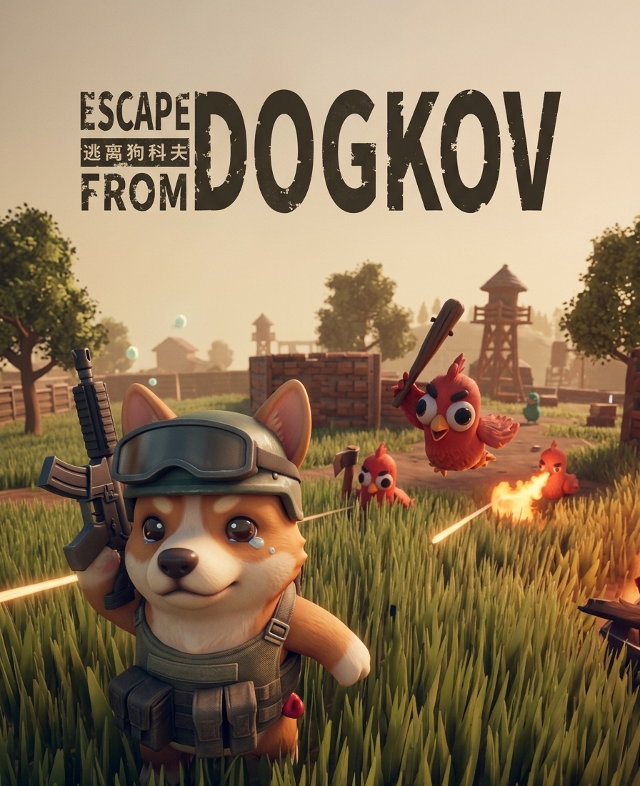

# 🎮 Escape From Dogcov

스팀게임 "Escape From Duckov" 모작 익스트랙션 슈터 게임

---

## 📺 플레이 영상

> 클릭하면 YouTube로 이동합니다

---

## 🛠 사용 기술

- **Engine:** Unity 2022.3.62f3
- **Language:** C#
- **개발 인원:** 1인 (Solo Development)
- **개발 기간:** 2025.11 ~ 2026.03

---

## ⚙️ 주요 기능

| 기능 | 설명 |
|------|------|
| 드래그 앤 드롭 인벤토리 | 아이템 이동, 슬롯 타입별 장착 제한 |
| 쿼터뷰 조준 시스템 | 반동 + 카메라 각도 보정 |
| NavMesh 적 AI | 상태 머신 (Patrol → Chase → Attack) |
| 보안 슬롯 | 사망해도 아이템 유지 |

---

## 📎 상세 포트폴리오

GIF, 핵심 코드, 트러블슈팅 등 자세한 내용:

👉 **[Notion 포트폴리오 바로가기](https://www.notion.so/Escape-From-Dogkov-a77781ccbe2c834d8c0481df1ede9c9d)**

---

## 🎮 조작법

| 키 | 동작 |
|----|------|
| WASD | 이동 |
| 마우스 | 조준 |
| 좌클릭 | 발사 |
| R | 재장전 |
| 1, 2 | 무기 교체 |
| Tab | 인벤토리 |
| F | 상호작용 |
| ESC | 일시정지 |
